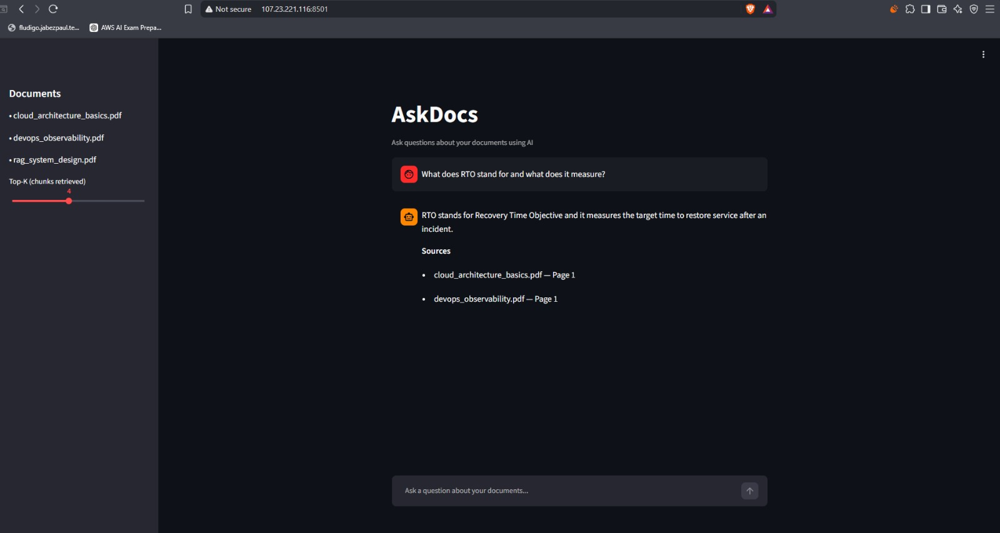
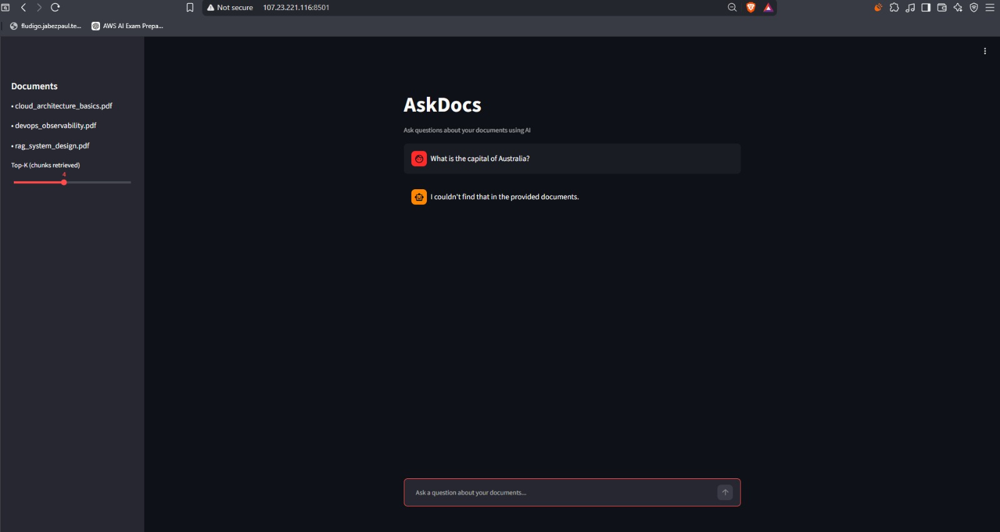
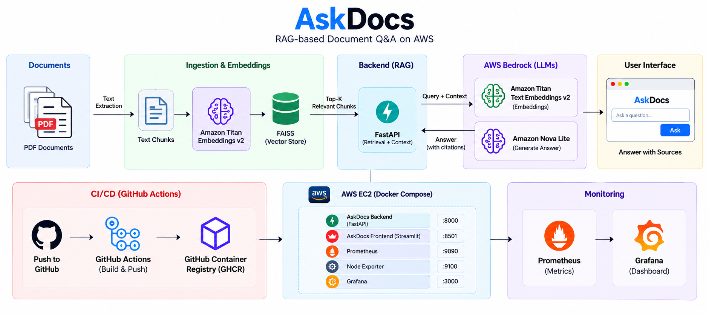
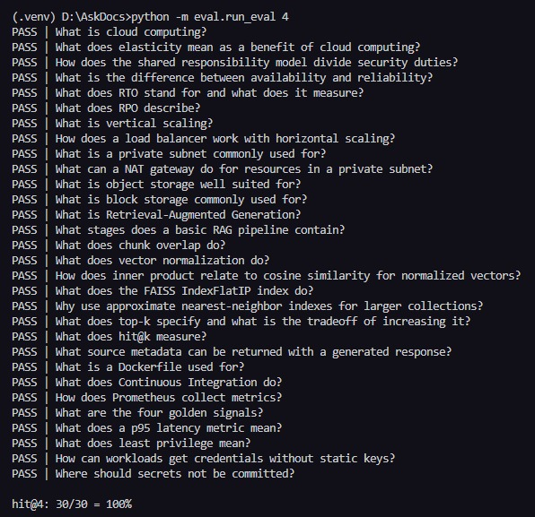
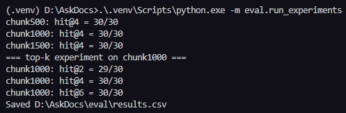
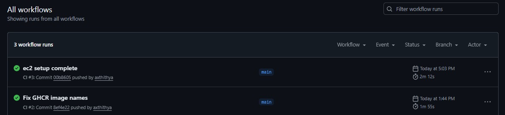
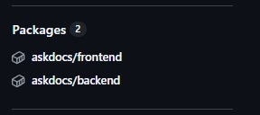
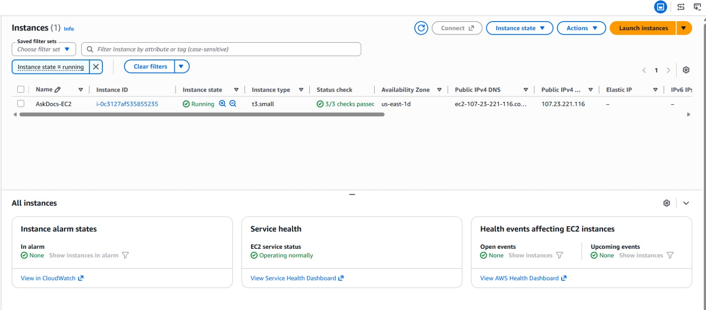
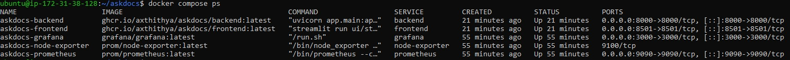
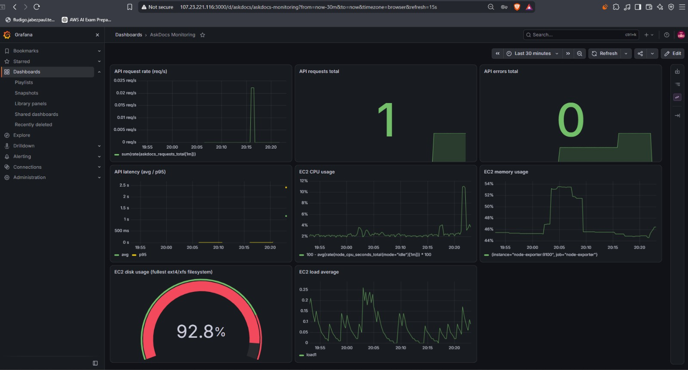

# AskDocs

AskDocs is a document question-answering application built with Retrieval-Augmented Generation (RAG). It indexes text from PDFs with Amazon Titan Text Embeddings V2, retrieves relevant passages with FAISS, and uses Amazon Nova Lite to produce an answer with retrieved document and page references.

## Overview

AskDocs helps users find answers in a small collection of technical PDFs. A Streamlit chat interface sends questions to a FastAPI service, which retrieves passages from a prebuilt local FAISS index and supplies them as context to the language model.

The repository includes local development code, Docker images and Compose deployment configuration, a GitHub Actions workflow, and Prometheus/Grafana monitoring configuration.

## Demo

A question supported by the indexed documents returns an answer and source pages:



When the retrieved context does not support an answer, the prompt asks Nova Lite to say it could not find the answer. The UI suppresses the retrieved source list for that refusal response:



## Architecture



**Question and answer path:** PDFs → page text extraction and chunking → Titan embeddings → FAISS search → top-K passages → FastAPI prompt → Nova Lite → answer and retrieved sources.

**Deployment and operations path:** GitHub push or pull request → GitHub Actions checks and image builds → GHCR publication on pushes to main → Docker Compose services on EC2 → Prometheus metrics and Grafana dashboard.

## How RAG Works

1. **Extract:** pypdf reads text page by page from PDFs in data/pdfs/.
2. **Chunk:** extracted page text is whitespace-normalized and split into character-count chunks with overlap. Each chunk keeps its PDF filename and page number.
3. **Embed and index:** Titan Text Embeddings V2 creates normalized 512-dimensional vectors by default. FAISS IndexFlatIP stores them; with normalized vectors, inner product is used as cosine similarity.
4. **Embed the question:** the backend sends the question to the same embedding model.
5. **Retrieve:** FAISS returns the top-K most similar chunks. Top-K is the number of passages supplied as candidates; the default is 4.
6. **Generate:** FastAPI places the question and retrieved passages into a prompt instructing Nova Lite to use only the supplied context and to state when it cannot find the answer.
7. **Return sources:** the API returns the generated answer and metadata for the retrieved chunks. The UI displays distinct PDF/page pairs, except when it detects the refusal phrase.

## Technology

| Area | Technologies |
|---|---|
| AI and retrieval | Amazon Bedrock, Titan Text Embeddings V2, Amazon Nova Lite, FAISS |
| Backend | Python, FastAPI, Pydantic, pypdf, boto3 |
| Frontend | Streamlit |
| Deployment | Docker, Docker Compose, AWS EC2, GitHub Container Registry (GHCR) |
| CI/CD | GitHub Actions |
| Monitoring | Prometheus, Node Exporter, Grafana |
| Quality | pytest, Ruff |

## Project Structure

```text
.
├── .github/workflows/ci.yml       # Tests, lint, image build and GHCR publication
├── app/
│   ├── bedrock.py                 # Bedrock embedding and generation calls
│   ├── config.py                  # Environment-based settings
│   ├── ingest.py                  # PDF extraction, chunking and index creation
│   ├── main.py                    # FastAPI routes and application metrics
│   ├── rag.py                     # Retrieval, prompt and answer orchestration
│   └── retriever.py               # FAISS vector search
├── data/
│   ├── pdfs/                      # Source PDFs
│   ├── index/                     # Built FAISS index and chunk metadata
│   └── experiments/               # Cached experiment indexes (ignored by Git)
├── docs/images/                   # Project screenshots
├── eval/                          # Retrieval and generation evaluation scripts/data
├── monitoring/                    # Prometheus and Grafana configuration/dashboard
├── tests/                         # Chunking and evaluation helper tests
├── ui/streamlit_app.py            # Streamlit chat UI
├── Dockerfile.backend
├── Dockerfile.frontend
├── docker-compose.yml             # Five-service deployment stack
├── docker-compose.ec2.yml         # Backend/frontend EC2 Compose variant
└── requirements.txt
```

The main index files, data/index/faiss.index and data/index/chunks.json, are generated by ingestion and are git-ignored. The Compose deployment mounts an index prepared on its host.

## Evaluation

The retrieval evaluation uses 30 questions based on the three PDFs in data/pdfs/. A hit requires at least one of the top-K retrieved chunks to come from the expected PDF and contain that question's expected keyword. This keyword-based check is a retrieval proxy; it does not measure answer correctness.



The checked-in eval/results.csv records:

| Experiment | Hit result |
|---|---:|
| 500-character chunks / 100 overlap, K=4 | 30/30 (100%) |
| 1,000-character chunks / 150 overlap, K=4 | 30/30 (100%) |
| 1,500-character chunks / 200 overlap, K=4 | 30/30 (100%) |
| 1,000 / 150 chunks, K=2 | 29/30 (96.67%) |
| 1,000 / 150 chunks, K=4 | 30/30 (100%) |
| 1,000 / 150 chunks, K=6 | 30/30 (100%) |

These are results for the checked-in dataset and index configurations, not a general accuracy guarantee. The experiment script chooses chunk size 1,000 / overlap 150 as the default for its Top-K comparison; K=4 reaches the same measured hit rate as K=6 with fewer retrieved passages.

## Retrieval Experiments

The chunk experiment compares three configurations at K=4. The first number is the maximum chunk length in characters; the second is the number of overlapping characters between adjacent chunks.



The CSV shows 30/30 hits for each tested configuration. The Top-K comparison, run with 1,000-character chunks and 150-character overlap, recorded 29/30 at K=2 and 30/30 at K=4 and K=6. A Top-K screenshot is not present in docs/images/; these values come from eval/results.csv.

## Grounding Behavior

The prompt in app/rag.py instructs Nova Lite to answer only from the retrieved context, avoid inventing facts, and use the phrase “I couldn't find that in the provided documents.” when context does not contain the answer. The UI hides sources when it recognizes this phrase.

python -m eval.run_generation includes a basic no-answer phrase check over five unrelated questions. This checks for the expected response text; it is not a rigorous hallucination or answer-quality evaluation.

## Local Development

The local workflow runs the Python API and Streamlit UI directly. It requires Python 3.12 (the CI workflow uses 3.12), an AWS identity available through boto3's default credential chain, and permission to invoke the configured Bedrock models.

1. Clone the repository and enter it:

   ```bash
   git clone <repository-url>
   cd AskDocs
   ```

2. Create and activate a virtual environment, then install dependencies:

   ```bash
   python -m venv .venv
   # Windows PowerShell
   .venv\Scripts\Activate.ps1
   # Linux/macOS: source .venv/bin/activate
   python -m pip install -r requirements.txt
   ```

3. Configure AWS credentials using an AWS profile/standard credential chain or environment variables. Do not put credentials in source files. The identity needs bedrock:InvokeModel access for the configured Titan and Nova models in the selected region. Defaults are us-east-1, amazon.titan-embed-text-v2:0, and amazon.nova-lite-v1:0.

4. Put text-based PDFs in data/pdfs/ and build the index:

   ```bash
   python -m app.ingest
   ```

   Ingestion writes data/index/faiss.index and data/index/chunks.json. Rebuild the index after changing the PDFs. Scanned image-only PDFs need OCR before ingestion.

5. Start the API in one terminal:

   ```bash
   uvicorn app.main:app --reload
   ```

6. Start the UI in a second terminal:

   ```bash
   streamlit run ui/streamlit_app.py
   ```

7. Open the URL printed by Streamlit (normally http://localhost:8501). The API health endpoint is http://localhost:8000/health.

Useful configuration defaults in app/config.py include CHUNK_SIZE=1000, CHUNK_OVERLAP=150, TOP_K=4, EMBED_DIM=512, DATA_DIR=data, and INDEX_DIR=data/index. Set API_URL to change the UI's API target.

## Docker Deployment

The Dockerfiles build separate backend and frontend images. The backend image runs Uvicorn; the frontend image runs Streamlit. The committed docker-compose.yml uses GHCR images and mounts host paths under /home/ubuntu/askdocs/, so it is configured for the deployment host rather than a portable local checkout. It expects the index and PDFs to exist at the mounted host locations.

The Compose stack defines:

| Compose service | Container | Purpose |
|---|---|---|
| backend | askdocs-backend | FastAPI and Bedrock-backed RAG |
| frontend | askdocs-frontend | Streamlit interface |
| prometheus | askdocs-prometheus | Scrapes application and host metrics |
| node-exporter | askdocs-node-exporter | Exposes host metrics |
| grafana | askdocs-grafana | Dashboard visualization |

On the configured host, set GRAFANA_ADMIN_PASSWORD in the environment and start the stack from the repository directory:

```bash
docker compose pull
docker compose up -d
```

The deployment publishes ports 8000 (API), 8501 (UI), 9090 (Prometheus), and 3000 (Grafana). The separate docker-compose.ec2.yml contains just the backend and frontend and uses its own host data paths.

## CI/CD

The workflow in .github/workflows/ci.yml runs on pushes and pull requests. It installs requirements, runs pytest and Ruff, then builds both Docker images. The Docker job depends on the test job.



On pushes to main, the workflow logs into GHCR with the repository's GITHUB_TOKEN and publishes backend and frontend images tagged latest and with the commit SHA. Pull requests and other branch pushes build the images without publishing them.



The tests do not call Bedrock. The current pytest suite covers chunking and evaluation helper behavior.

## AWS Deployment

AskDocs is deployed on an AWS EC2 host with Docker Compose and GHCR container images. The deployment screenshot shows the EC2 instance; the repository does not document an instance type.



The EC2 Compose configuration mounts the prebuilt index and PDF directory from host storage. The backend uses boto3's default AWS credential chain and the configured AWS_REGION; no AWS access keys are set in the Compose service configuration. The repository does not include the EC2 provisioning or IAM role policy configuration.



## Monitoring

Prometheus scrapes the FastAPI /metrics endpoint and Node Exporter every 15 seconds. The backend exports request counts labeled by success/error status and request duration. Node Exporter exposes host-level metrics; Grafana loads the provisioned Prometheus datasource and AskDocs dashboard.

The dashboard includes API request rate and total, API errors, average and p95 request latency, and host CPU, memory, disk, and load.



## Security and Cost

- Bedrock calls require AWS credentials and incur usage charges.
- The checked-in Compose configuration does not provide AWS access keys to the backend; boto3 obtains credentials from its runtime environment.
- Grafana's password is supplied through GRAFANA_ADMIN_PASSWORD. The Compose file does not set a secure default, so configure it before exposing the service.

## Limitations

- FAISS and the index files are local to the deployment; the repository does not configure a managed vector database.
- Updating documents requires rebuilding and replacing the index.
- Retrieval evaluation uses expected source plus keyword matching; it is not an end-to-end answer accuracy score.
- The API returns metadata for retrieved chunks. The displayed sources indicate retrieved context, and do not verify which exact passages the model relied on.

## Future Improvements

- Add document upload and index rebuild controls.
- Expand the retrieval dataset and evaluate answer quality and citation precision.
- Add authentication and a managed HTTPS entry point.
- Consider a managed vector store for larger document collections.

## What This Project Demonstrates

RAG ingestion and retrieval, embedding-based search, Amazon Bedrock integration, FastAPI and Streamlit application design, Docker image packaging and Compose deployment, AWS EC2 operations, GitHub Actions and GHCR automation, Prometheus/Grafana monitoring, and retrieval evaluation.

## Resume-Level Summary

- Built a PDF question-answering application using Amazon Bedrock embeddings and generation, FAISS retrieval, FastAPI, and Streamlit, returning answers with retrieved document/page metadata.
- Packaged and deployed the service with Docker Compose on EC2, automated checks and GHCR image publication with GitHub Actions, and configured Prometheus/Grafana monitoring.
- Evaluated retrieval on 30 document questions across chunk and Top-K settings; recorded 30/30 keyword-based hits at K=4 for the tested configurations.
